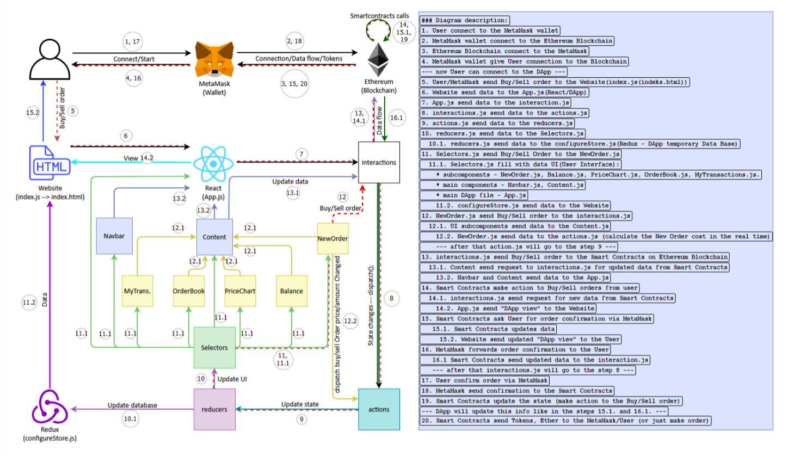

# DApp Crypto Exchange
## Dapp University course

- Deployado en Heroku
    -   https://decrypt-dapp-u.herokuapp.com/

- Download the metamask browser extension

- Configure testnet on your metamask browser extension (metamask config => id: 4002, rpc: "https://rpc.testnet.fantom.network/").

- Go to https://faucet.fantom.network/ and put your metamask address account in order to receive some fake FTM for transaction fees.

- Make sure you are in the FTM testnet network in your metamask. (test FTM's will be ETH in this case)

- Trade!

## project diagram

## Overview
<!--  -->